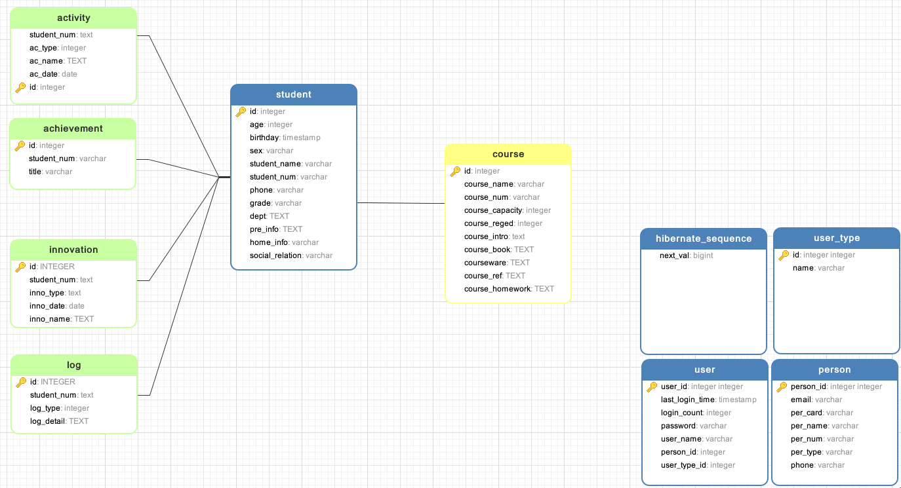
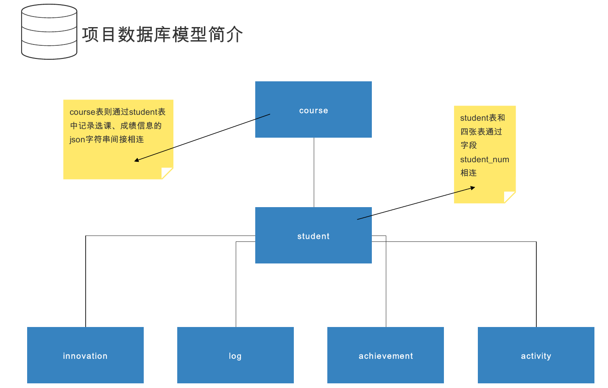
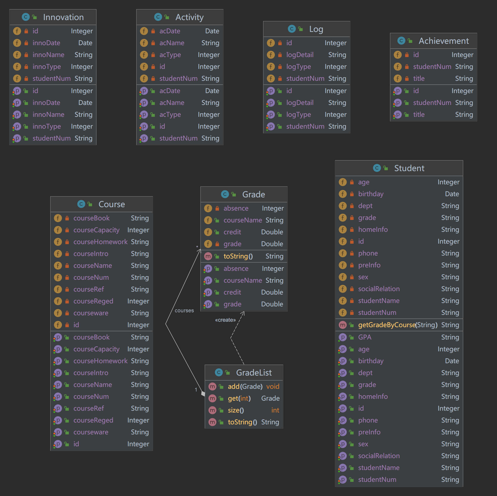

# SDUStudentManagement

>   Course design of Advanced Program Development of SDU

## 项目简介

一个基于 Spring Boot、Spring Boot Jpa、Vue 等技术的前后端分离的后台管理系统。

**账号密码：** `admin / 123456`

后端项目地址：https://github.com/intMojIBakE/SDUStudentManagement

## 主要特性

-   使用较新的技术栈，社区资源丰富。
-   使用 sqlite，支持数据字典，配合 **Navicat** 对数据库进行有效管理。
-   包含权限注解，可快速对接口拦截与放行。
-   支持修改项目配置和 Vue 项目的配置，方便前后端分离部署。
-   使用 Html + CSS 对前端框架重构，界面美观。

## 系统功能

-   用户管理：提供用户的相关配置，默认用户为管理员。
-   角色管理：支持权限分配，可根据设置角色的数据权限。
-   菜单管理：后端使用 yaml 文件动态配置多级菜单及额外功能。
-   数据库管理：利用 sqlite 实现小型数据库的嵌入使用，可拓展性较强，支持 Navicat 配置。
-   学生管理：实现了完备的学生数据的增删查改，基本保证程序鲁棒性、数据健壮性。
-   学生信息管理：学生信息和与学生相关性较大的信息有效联动，实现外键设置，具有联合查询、级联删除等特性。

## 项目结构

项目采用按功能分模块的开发方式，主要结构如下：

-   `models` 为系统所用的实体类模块，包含一些重要的中间类，如`Grade`、`GradeList`。
-   `service` 层包括了系统使用的一些服务，主要是个人简历部分的相关内容。
-   `controllers` 层负责分发、完成前端传递的操作。

------

-   数据库 ER 图如下：

-   数据库模型如下：

-   UML 图如下：

